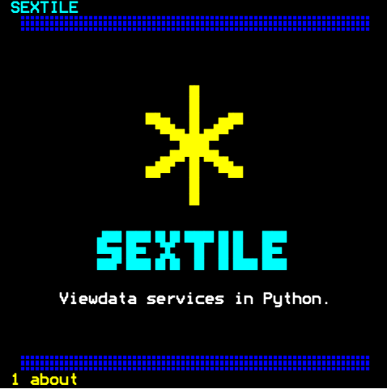

# Sextile



[](https://github.com/rob-smallshire/sextile/actions/workflows/ci.yml)
[](https://pypi.org/project/sextile/)
[](https://pypi.org/project/sextile/)
[](https://github.com/rob-smallshire/sextile/blob/master/LICENSE)
[](https://rob-smallshire.github.io/sextile/)

A framework for Prestel-style Viewdata services in Python. Named after the star
key on a viewdata keypad.

Viewdata or Videotex services, such as Prestel in Britain, were among the
earliest interactive services of the information age: a terminal dialled a
remote computer over a telephone line equipped with a modem, and the computer
answered with pages of text. The display was simple, twenty-four rows of forty
characters in seven colours with block mosaics, and the reader moved through the
pages by keying page numbers on a telephone keypad, a dedicated terminal or a
microcomputer. The BBC Micro and other home computers of the day ran software
that could dial and display such a service.

Sextile builds such services today, in Python. It is to a Viewdata service what
Flask or Starlette is to a web application: it manages the connection, the
caller's session, the page numbering and the frames of text and graphics. You
write what the pages say and how the reader interacts with them. Sextile is the
framework; the Viewdata services built on it are Sextile applications.

See the [documentation](docs/index.md) for more.

```
packages/sextile/              the framework: connections, sessions, routing,
                               page numbering, frames on the wire
packages/stardot-viewdata/     the Stardot phpBB forum, as Viewdata
packages/calendar-viewdata/    a calendar; the framework's worked example
packages/weather-viewdata/     the weather, from met.no and a local gazetteer
```

Installation is easiest with [`uv`](https://docs.astral.sh/uv/), which handles
Python installation and virtual environments for you.

```sh
uv add sextile          # or pip install sextile
```

A simple Sextile service, answering page 1 with a notice, is:

```python
from sextile import Page, PageRequest, Sextile, notice_page

app = Sextile(name="My service")

@app.page("1", name="main", keywords=("MAIN",))
async def main(request: PageRequest) -> Page:
    return notice_page(request, "Hello, 1981.")
```

Start the Sextile server. It will answer on its default TCP port 16650

```sh
uv run sextile serve my_service:app                 # answer calls on port 16650
```

Call it using `netcat` on port 16650,

```
nc localhost 16650                                   # and call it
```

or render a page directly to Unicode text,

```
uv run sextile render my_service:app --page 1       # or draw a page without a terminal
```

or as self-contained HTML,

```
uv run sextile render my_service:app --page 1 --form html      # or draw a page without a terminal
```

## Documentation

Built from [`docs/`](docs/index.md), in five parts: a **tutorial**
that builds one service, **how-to** guides, a **reference** for the surface, the
glossary and the wire, an **explanation** of why it is shaped as it is, and the
three **applications** worked through.

```sh
uv run --group docs sphinx-build -n -W --keep-going -b html docs docs/_build/html
```

## Working on it

```sh
uv run pytest        # the whole workspace
uv run ruff check .
uv run mypy          # --strict, including the tests
```

All four — the three above and the docs build — must pass. The Sextile code is MIT licensed;
however, some  material in this repository is not ours to license and
is licenced separately, see [NOTICE.md](NOTICE.md)
