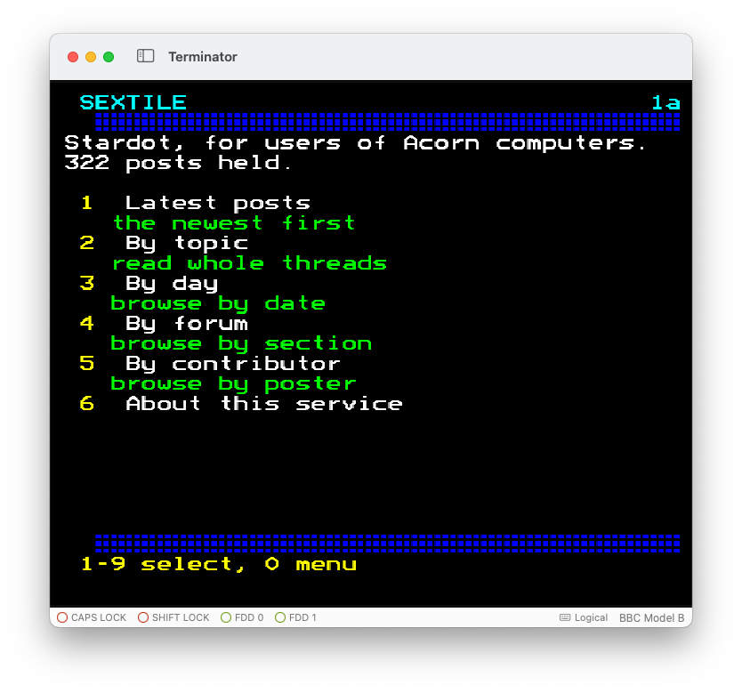

# stardot-viewdata

A Prestel-style Viewdata service presenting the [Stardot](https://stardot.org.uk)
forum to 1980s Acorn computers. It is an application built on
[Sextile](../sextile/README.md), which is the framework underneath and knows
nothing about forums.

Stardot is a phpBB board for Acorn enthusiasts. This service reads its Atom feed
and serves the result as 40x24 teletext frames over a serial line, so it can be
read on a real BBC Micro running period comms software.

## State

Read-only and feed-driven, and it answers calls: the whole path from Stardot's
Atom feed to frames on a terminal is built and tested.

```
Atom feed  --> ingest --> SQLite --> content blocks --> frames --> session --> transport --> BBC
             (polite)    (archive)    (semantic)       (40x24)    (Prestel)     (TCP)
                done        done         done            done       done        done
```

A poller keeps the archive fed. What remains is the presentation work that only
watching a real screen can settle — see
[docs/open-questions.md](../../docs/open-questions.md).

## Connecting a BBC Micro

Sextile is a plain TCP server. Everything between it and a Beeb is off-the-shelf:
[tcpser](https://github.com/go4retro/tcpser) presents a TCP service as an
emulated Hayes modem on an ip232 endpoint, and the emulator dials it. The first
four steps each start something that keeps running, so each needs its own shell.

**1. Fetch Stardot's content into the archive — first shell**

```sh
uv run stardot-viewdata ingest --once     # one request: the ten latest posts
uv run stardot-viewdata ingest            # then poll every five minutes, until stopped
```

The first command is enough to have something to look at. Later, `ingest --seed`
sweeps every route the board publishes — the latest posts, the newest and active
topics, then each forum and each topic it has just learned of. (Seeding makes one
request per route and the site asks for sixty seconds between requests, so a
sweep takes about as many minutes as there are routes: an hour or so for Stardot,
and several for a re-sweep of a full archive. Nothing is lost if it is
interrupted; the archive keeps what it has.)

**2. Serve it — second shell**

```sh
uv run stardot-viewdata serve             # answers on port 16650
```

**3. Put a Beeb or emulator in front of it**

The remaining steps — bridging TCP to an emulated modem with tcpser, pointing an
emulator's serial port at it, and dialling from Commstar — are the same for any
Sextile service and are written up in the how-to guide
[Connect a BBC Micro](../../docs/how-to/connect-a-bbc.md).



## Trying it without a Beeb

```sh
uv run stardot-viewdata render --page 1            # the main index
uv run stardot-viewdata render --page 8            # latest posts
uv run stardot-viewdata render --page 82489493     # one post, by its Stardot id
uv run stardot-viewdata render --page 8 --frame 1  # its second frame

uv run stardot-viewdata render --page 1 --form grid   # character and attributes
uv run stardot-viewdata render --page 1 --form bytes  # the wire, as a hex dump

uv run stardot-viewdata archive                      # what the archive holds
nc localhost 16650                           # call the server from a terminal
```

`render --page` also prints, to standard error, where each key would lead —
the quickest way to check a menu is wired up correctly.

## Getting about

Moving about is two-dimensional, and the keys say so:

```
        W                 W, S    up and down the frames of this item
   A    ·    D            A, D    back and forward through the items
        S                 #       the same as S, the conventional viewdata key
```

**The BBC's own cursor keys do the same four things.** They transmit 0x88-0x8B,
and the 7E1 line takes the eighth bit, landing them on the viewdata
cursor-control codes 0x08-0x0B — so arrows and WASD are two spellings of one
compass. Measured, not assumed: `docs/spikes/spike_cursor_keys.py`.

Vertical within an item, because a document reads top to bottom; horizontal
between items, one to the next.

```
*nnn#     go to a page              1-9   select from the menu
*0#       back, through history     0     the main index
*00#      show this frame again     *     cancel a request being typed
*09#      fetch it afresh           DEL   rub out; over the star, cancel
**        cancel and begin again
```

Commstar does not echo a page request, so Sextile draws it: while one is being
typed the footer becomes a command line, white on blue, with a reminder that `*`
cancels. It is drawn over that row alone rather than by redrawing the frame, and
the cursor is left where the next character goes — so a typed character costs
one byte and a rub-out three.

`**` is then simply cancel followed by begin, which leaves an empty buffer ready
for a new number — what Prestel's `**` did, for a reader who types it out of
habit.

[docs/navigation.md](../sextile/docs/navigation.md) has the whole model and the reasoning
behind it.

**A frame names only the keys that do something on it**, in a footer that says
so compactly:

```
1-9 select, S page down, 0 index       a menu, with more frames below
1, 2, 3, 4, A prev, D next, 0 index     a post reached through a sequence
1, 2, 3, 4, 0 index                     the same post reached by its number
```

Each key is named by its letter and what it does — `W` and `S` page a menu,
`A` and `D` step through a sequence — and the words shorten as the row fills,
`page down` to `down` and then to nothing. At its longest the footer is exactly
forty cells including its colour attribute, which is a whole row, and there is a
test to keep it that way.

WASD is deliberately anachronistic: it postdates viewdata by a decade, where
everything else here is period-correct to the byte. `#` therefore keeps working
alongside `S`, because it is the one key a viewdata reader will try without
being told.

Keyword jumps work too: `*MAIN#`, `*LATEST#`, `*DAYS#`, `*FORUMS#`, `*WHO#`,
`*ABOUT#`, `*BYE#`.

Page numbers follow the board's own identifiers, so `*82489493#` here is post
489493 there. See [docs/page-numbering.md](docs/page-numbering.md).

## How it is put together

Everything about connections, sessions, frames and routing belongs to
[Sextile](../sextile/README.md). What is here is the information architecture --
which page numbers exist, what each one shows, where its keys lead -- along with
the archive and the polite ingest that fills it.

The archive and the Atom feed are both provisional. The board's administrator
has offered a phpBB extension exposing forum content directly, which would
replace both without disturbing the numbering or the rendering; see
[docs/target-architecture.md](../../docs/target-architecture.md).

## What was measured rather than assumed

Much of the design rests on facts established against real software rather than
on documentation:

- Attributes must be escape-encoded as `ESC` + code + 0x40. The SAA5050's own
  0x80-0x9F codes do not survive Prestel's 7E1 line.
- A frame is exactly 24 rows of 40 cells. Column 40 wraps by itself, and the
  bottom right cell wraps back to the top left rather than scrolling.
- `RETURN` transmits 0x5F, not 0x23, so a page request ends with 0x5F.
- Page numbers have no practical length limit; the nine-digit Prestel maximum
  was a property of Prestel's database, not of any terminal.
- Python's `urllib.robotparser` reads Stardot's robots.txt incorrectly, so
  Sextile implements RFC 9309 matching itself.

See `docs/viewdata-encoding.md` and `docs/page-numbering.md`, and the spikes in
`docs/spikes/` that settled each question.

## Politeness

Stardot asks for a 60-second crawl delay and forbids several paths, including
`viewtopic.php?p=`. Sextile enforces both in code, with its own RFC 9309 matcher
because Python's `urllib.robotparser` reads the board's file wrongly and would
permit what it forbids.

## Development

```sh
uv run pytest
uv run ruff check .
uv run mypy
```

The spikes under `docs/spikes/` need a local Beebium checkout and are not part
of the test suite; they are kept as the record of how each question was
answered.

## Reading further

Start with the architecture, then follow whichever narrative you need: one
takes a post from the archive to the wire, the other a keypress from the
terminal to a reply.

| | |
|---|---|
| [applications/stardot.md](../../docs/applications/stardot.md) | the worked example, with a page drawn live |
| [design.md](docs/design.md) | this service as built: numbering, archive, ingest, phpBB's HTML |
| [architecture.md](../../docs/architecture.md) | the workspace, and where the seams are |
| [rendering.md](../sextile/docs/rendering.md) | how a post becomes bytes, stage by stage |
| [navigation.md](../sextile/docs/navigation.md) | how a reader moves about, and why the controls are what they are |
| [page-numbering.md](docs/page-numbering.md) | the numbering scheme and why it uses Stardot's own ids |
| [viewdata-encoding.md](../sextile/docs/viewdata-encoding.md) | what the BBC end actually does, and how we know |
| [spikes/README.md](../../docs/spikes/README.md) | the ten questions measured on real hardware, and their answers |
| [feed-limitations.md](docs/feed-limitations.md) | what the Atom feed cannot tell us |
| [phpbb-feed-code-newlines.md](docs/phpbb-feed-code-newlines.md) | a defect in phpBB's feed, found here and since fixed |
| [open-questions.md](../../docs/open-questions.md) | known gaps, and what is deliberately not done |

`CLAUDE.md` records how the project is built, for anyone — human or otherwise —
picking it up.

## Licence

MIT — see [LICENSE](LICENSE).

The test fixtures under `tests/data/` are Atom documents captured from Stardot
and contain posts written by members of that forum. Those words are their
authors' own and are not covered by the grant; see [NOTICE.md](../../NOTICE.md).
